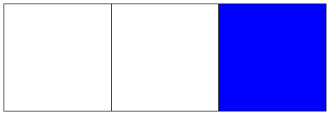
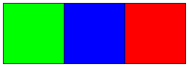
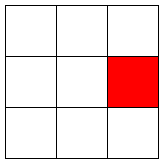
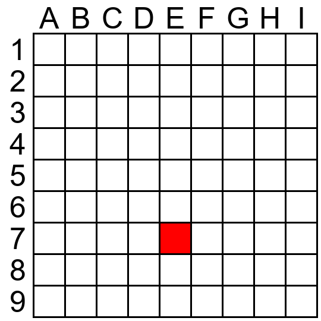

# Optometrist

A testing framework for evaluating the visual reasoning skills of multi-modal models.

Optometrist can generate vision exams and send them to GPT-4 Vision or Gemini Pro to evaluate their accuracy.

## Setup

1. Have [pipenv](https://github.com/pypa/pipenv) installed on your system.
2. Run `pipenv install`
3. Copy `models_template.yml` to `models.yml`
4. Fill out `models.yml` with your API tokens

## Running

1. `pipenv shell`
2. `python run_exams.py --help`

## Exams

### Dummy

`python run_exams.py dummy`

The simplest exam, useful only to make sure your API tokens are working properly before running any other exams.

### Left-Right-Center

The model is presented with a grid of 3 squares and asked to answer with LEFT, RIGHT or CENTER depending on the prompt.

#### Single-Fill

`python run_exams.py lrc_single_fill`

In the single-fill LRC variation, only one square of the grid is filed and the model is asked to identify which square is filled.

Example:

`You are being shown a grid with three squares. Which one of the squares is filled in with the color BLUE? Respond with one of LEFT, CENTER, or RIGHT.`

#### Multi-Fill

`python run_exams.py lrc_multi_fill`

In the multi-fill LRC variation, all squares are filled and the model is asked to identify which square is filled with a specific color.

Example:

`You are being shown a grid with three squares. Which one of the squares is filled in with the color RED? Respond with one of LEFT, CENTER, or RIGHT.`

### Alignment Chart

`python run_exams.py alignment_chart_single_fill`

The model is shown a 3x3 grid and is asked to describe which square is filled in.

Example:

`You are being shown 3x3 grid of squares. Which one of the squares is filled in? Respond in the format X,Y where X is one of LEFT, RIGHT, or CENTER and Y is one of TOP, MIDDLE, or BOTTOM`

### Battleship

`python run_exams.py battleship_single_fill --grid-size=6`

The model is shown a variable-sized grid of squares with an alpha-numeric coordinate system and is asked to identify which square is filled in.

Example:

`You are being shown a grid of squares. Which one of the squares is filled in? Respond with only the coordinate of the filled in square. An example answer would be A7.`

## Results

The results of the exam will be written to `exam_runs/<current_datetime>` as a CSV. There will also be an `img` folder that contains the images sent to the models for each question.
